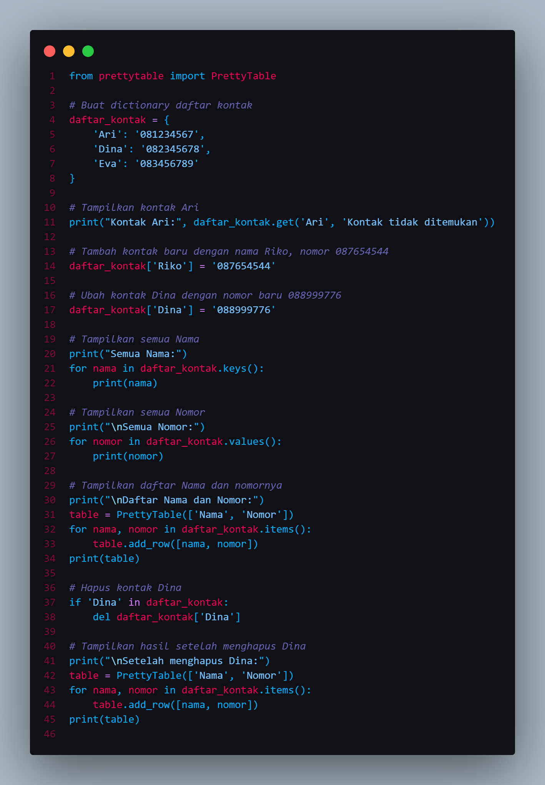
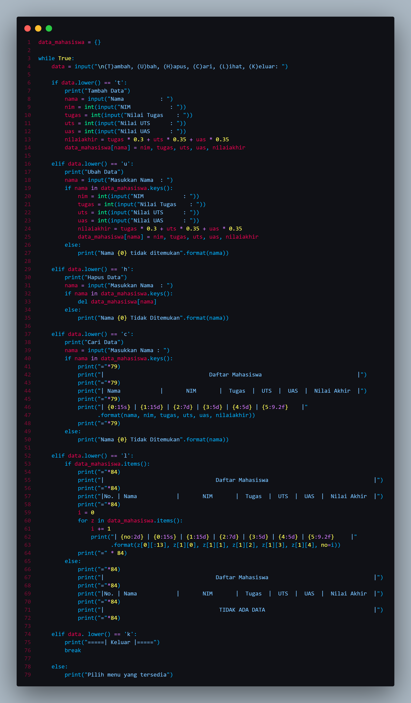
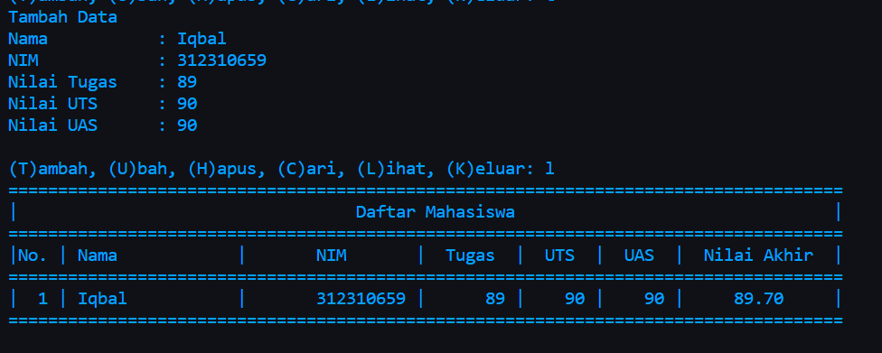
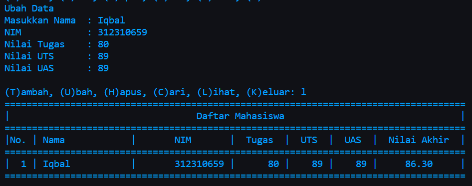
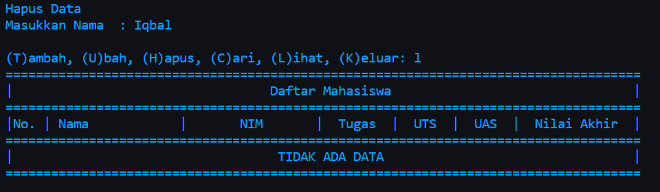
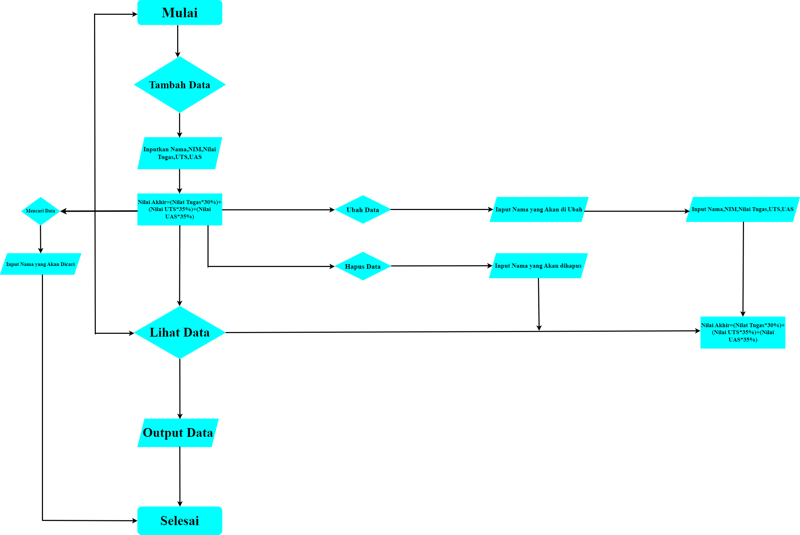

# Praktikum 5
# Latihan
## Membuat Dictionary daftar kontak
```python
daftar_kontak = {
    'Ari': '081234567',
    'Dina': '082345678',
    'Eva': '083456789'
}
```

## Menampilkan Kontak Ari
```python
print("Kontak Ari:", daftar_kontak.get('Ari', 'Kontak tidak ditemukan'))
```

## Menambahkan kontak Riko
```python
daftar_kontak['Riko'] = '087654544'
```

## Mengubah kontak Dina
```python
daftar_kontak['Dina'] = '088999776'
```

## Tampilkan semua nama
```python
print("Semua Nama:")
for nama in daftar_kontak.keys():
    print(nama)
```

## Tampilkan semua nomor
```python
print("\nSemua Nomor:")
for nomor in daftar_kontak.values():
    print(nomor)
```

## Tampilkan daftar Nama dan nomornya
```python
print("\nDaftar Nama dan Nomor:")
table = PrettyTable(['Nama', 'Nomor'])
for nama, nomor in daftar_kontak.items():
    table.add_row([nama, nomor])
print(table)
```

## Menghapus kontak Dina
```python 
if 'Dina' in daftar_kontak:
    del daftar_kontak['Dina']
```

## Tampilkan hasil setelah menghapus Dina
```python 
print("\nSetelah menghapus Dina:")
table = PrettyTable(['Nama', 'Nomor'])
for nama, nomor in daftar_kontak.items():
    table.add_row([nama, nomor])
print(table)
```



# Praktikum
## Program Data Mahasiswa



- Membuat dictionary kosong
```python
data_mahasiswa = {}
```
- Membuat kondisi perulangan dan keterangan untuk pilihan menu
```python
while True:
    data = input("\n(T)ambah, (U)bah, (H)apus, (C)ari, (L)ihat, (K)eluar: ")
```
- Menambahkan data
```python
if data.lower() == 't':
        print("Tambah Data")
        nama = input("Nama           : ")
        nim = int(input("NIM            : "))
        tugas = int(input("Nilai Tugas    : "))
        uts = int(input("Nilai UTS      : ")) 
        uas = int(input("Nilai UAS      : "))
        nilaiakhir = tugas * 0.3 + uts * 0.35 + uas * 0.35
        data_mahasiswa[nama] = nim, tugas, uts, uas, nilaiakhir
```
Apabila kita mengitputkan 't' maka kita akan diminta untuk mengitputkan data, seperti nama, nim, uts, dan uas. Data tersebut akan masuk ke dalam dictionary 'x' yang telah dibuat dengan data 'nama' sebagai keys dan sisanya sebagai values.

- Mengubah data
```python
elif data.lower() == 'u':
        print("Ubah Data")
        nama = input("Masukkan Nama  : ")
        if nama in data_mahasiswa.keys():
            nim = int(input("NIM            : "))
            tugas = int(input("Nilai Tugas    : "))
            uts = int(input("Nilai UTS      : "))
            uas = int(input("Nilai UAS      : "))
            nilaiakhir = tugas * 0.3 + uts * 0.35 + uas * 0.35
            data_mahasiswa[nama] = nim, tugas, uts, uas, nilaiakhir
        else:
            print("Nama {0} tidak ditemukan".format(nama))
```
Jika menginputkan 'u' makan akan ada keterangan untuk mengubah data dan kita akan diminta untuk menginputkan nama yang ingin diubah datanya, apabila nama tidak ada maka outputnya "Nama {} tidak ditemukan". {} adalah nama atau data yang mau diubah.

- Menghapus data
```python
elif data.lower() == 'h':
        print("Hapus Data")
        nama = input("Masukkan Nama  : ")
        if nama in data_mahasiswa.keys():
            del data_mahasiswa[nama]
        else:
            print("Nama {0} Tidak Ditemukan".format(nama))
```
Jika menginputkan 'h' maka akan diminta menginputkan nama yang ingin dihapus datanya. Jika nama ada dalam dictionary, maka sistem akan menghapus nama dan datanya.

- Mencari data
```python
 elif data.lower() == 'c':
        print("Cari Data")
        nama = input("Masukkan Nama : ")
        if nama in data_mahasiswa.keys():
            print("="*79)
            print("|                                Daftar Mahasiswa                             |")
            print("="*79)
            print("| Nama            |       NIM       |  Tugas  |  UTS  |  UAS  |  Nilai Akhir  |")
            print("="*79)
            print("| {0:15s} | {1:15d} | {2:7d} | {3:5d} | {4:5d} | {5:9.2f}    |"
                  .format(nama, nim, tugas, uts, uas, nilaiakhir))
            print("="*79)
        else:
            print("Nama {0} Tidak Ditemukan".format(nama))
```
Jika menginput 'c' makan akan diminta untuk memasukkan nama yang ingin dicari. Apabila nama yang dicari ada dalam dictionary maka outputnya akan menampilkan data dari nama tersebut.

- Menampilkan data
```python
elif data.lower() == 'l':
        if data_mahasiswa.items():
            print("="*84)
            print("|                                  Daftar Mahasiswa                                |")
            print("="*84)
            print("|No. | Nama            |       NIM       |  Tugas  |  UTS  |  UAS  |  Nilai Akhir  |")
            print("="*84)
            i = 0
            for z in data_mahasiswa.items():
                i += 1
                print("| {no:2d} | {0:15s} | {1:15d} | {2:7d} | {3:5d} | {4:5d} | {5:9.2f}     |"
                      .format(z[0][:13], z[1][0], z[1][1], z[1][2], z[1][3], z[1][4], no=i))
            print("=" * 84)
        else:
            print("="*84)
            print("|                                  Daftar Mahasiswa                                |")
            print("="*84)
            print("|No. | Nama            |       NIM       |  Tugas  |  UTS  |  UAS  |  Nilai Akhir  |")
            print("="*84)
            print("|                                   TIDAK ADA DATA                                 |")
            print("="*84)
```
Jika menginput 'l' maka akan menampilkan data yang sudah kita masukkan sebelumnya. Jika belum memasukkan data maka outputnya menjadi "TIDAK ADA DATA"

- Menghentikan perulangan
```python
 elif data. lower() == 'k':
        print("=====| Keluar |=====")
        break
```
Apabila menginput 'k' maka program langsung berhenti

## Tampilan Program
- Menambahkan Data



- Mengubah Data



- Menghapus Data


# Flowchart

